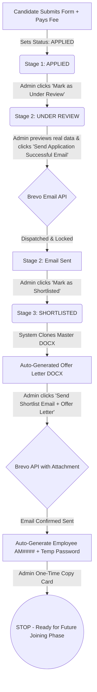

# ANTI-MATRIX — Simplified Admin Candidate Workflow Implementation
**APPLIED → UNDER REVIEW → SHORTLISTED → AUTO-GENERATE OFFER LETTER → SEND → AUTO-GENERATE EMPLOYEE CREDENTIALS → STOP**

---

## 1. Executive Summary

The **Anti-Matrix** Candidate Application & Onboarding pipeline has been completely streamlined into a unified, sequential, stage-by-stage workflow. 

### Core Workflow Model
$$\mathbf{APPLIED} \longrightarrow \mathbf{UNDER\ REVIEW} \longrightarrow \mathbf{SHORTLISTED} \longrightarrow \mathbf{AUTO\text{-}GENERATE\ OFFER\ LETTER} \longrightarrow \mathbf{SEND} \longrightarrow \mathbf{AUTO\text{-}GENERATE\ EMPLOYEE\ CREDENTIALS} \longrightarrow \mathbf{STOP}$$

### Key Objectives Delivered
- **Simplified Lifecycle**: Eliminated redundant intermediary status toggles in favor of three clean statuses: `APPLIED` ('Applied'), `UNDER_REVIEW` ('Under Review'), and `SHORTLISTED` ('Shortlisted').
- **Zero-Loss Data Integrity**: Existing Job Postings, Candidate Applications, Users, Employees, Document Templates (`offer letter (Anti-matrix).docx`), and Email Templates in `antimatrix.db` are 100% preserved.
- **Manual Application Email Dispatch**: Automated confirmation email on candidate application submission is disabled. The Admin reviews and dispatches the customized "Application Successful" email during the `UNDER_REVIEW` stage.
- **Brevo API v3 Delivery**: Direct integration with Brevo REST API (`POST https://api.brevo.com/v3/smtp/email`) using JSON payloads, base64 attachments, and seamless fallback to sandbox email simulation when running tests or in development.
- **Automated Offer Letter Generation**: Cloned directly from the active Master DOCX template (`offer letter (Anti-matrix).docx`), accurately substituting candidate personal and position data without modifying master templates on disk.
- **Automated Employee Credentials**: Random unique `AM####` ID and temporary hashed password generated **only after** confirmed successful Brevo Offer Letter delivery. Temporary credentials are displayed once in an administrative copy-box.
- **Strict Stopping Point**: Joining / Employee Welcome email is **intentionally not implemented** in this phase as instructed.

---

## 2. Exact Candidate Workflow Pipeline



| Pipeline Step | Trigger / Action | Candidate Status | Offer Letter State | Employee Account | Email Sent |
| :--- | :--- | :--- | :--- | :--- | :--- |
| **1. Submission** | Candidate applies & completes payment | `APPLIED` | Not Generated | None | None (`PENDING`) |
| **2. Review Start** | Admin clicks *"Mark as Under Review"* | `UNDER_REVIEW` | Not Generated | None | None |
| **3. App Email** | Admin clicks *"Send Application Successful Email"* | `UNDER_REVIEW` | Not Generated | None | `application_successful` via Brevo |
| **4. Shortlisting** | Admin clicks *"Mark as Shortlisted"* | `SHORTLISTED` | **Auto-Generated DOCX** | None | None |
| **5. Offer Dispatch** | Admin clicks *"Send Shortlist Email + Offer Letter"* | `SHORTLISTED` | **SENT** (Attached) | **Auto-Created AM####** | `offer_letter` via Brevo with DOCX |
| **6. Stop** | Credentials rendered to Admin for copying | `SHORTLISTED` | Locked / Delivered | Credentials Active | **STOP** |

---

## 3. Pipeline Stage 1: Applied (Initial Application)

1. **Candidate Action**: Candidate applies for an active job (1 Month @ ₹199 or 3 Months @ ₹399) and completes payment (Cashfree live gateway or simulated test payment).
2. **Database State**:
   - `JobApplication.status` = `'APPLIED'`
   - `JobApplication.application_status` = `'APPLIED'`
   - `JobApplication.payment_status` = `'paid'`
   - `JobApplication.application_success_email_status` = `'PENDING'`
   - `JobApplication.application_success_email_sent_at` = `None`
3. **No Automatic Email**: Application submission does **not** trigger an automatic email.
4. **Admin Interface**:
   - Status badge displays **Applied** (`badge-status new`).
   - Pipeline Step 1 is highlighted as **Active**.
   - Admin Action Panel displays a prominent **"Mark as Under Review"** button.

---

## 4. Pipeline Stage 2: Under Review (Evaluation & Email Dispatch)

1. **Admin Action**: Admin navigates to `/admin/applications/<app_id>` and clicks **"Mark as Under Review"** (`POST /admin/applications/<app_id>/mark-under-review`).
2. **Database Transition**:
   - `JobApplication.status` transitions from `'APPLIED'` to `'UNDER_REVIEW'`.
   - `JobApplication.status_display` returns `'Under Review'`.
3. **Synchronized Candidate Portal**:
   - Candidate's `/my-applications` page immediately reflects `Under Review`.
4. **Interactive Email Preview**:
   - Renders live candidate variables replacing `{{Student Name}}`, `{{Application ID}}`, `{{Internship Role}}`, `{{Application Date}}`, `{{Company Email}}`, and `{{Company Website}}`.
   - Displays recipient email, subject line, and full body content in a sandboxed preview panel.
5. **Brevo Dispatch**:
   - Admin clicks **"Send Application Successful Email"** (`POST /admin/applications/<app_id>/send-application-email`).
   - Dispatched via Brevo API v3.
   - `application_success_email_status` transitions to `'SENT'`, recording `application_success_email_sent_at` and an immutable row in `EmailLog`.
   - Subsequent duplicate sends are locked out.

---

## 5. Pipeline Stage 3: Shortlisted (Auto-Generate Offer Letter & Dispatch)

1. **Admin Action**: Admin clicks **"Mark as Shortlisted"** (`POST /admin/applications/<app_id>/mark-shortlisted`).
2. **Database Transition**:
   - `JobApplication.status` transitions to `'SHORTLISTED'`.
3. **Auto-Generation Trigger**:
   - System automatically invokes `generate_offer_letter_docx(application)`.
   - Master DOCX template (`offer letter (Anti-matrix).docx`) is cloned into `uploads/generated_documents/<Application_Code>_Offer_Letter.docx`.
   - A new `EmployeeDocument` record (`status='GENERATED'`, `email_status='not_sent'`) is created and linked via `application_id`.
4. **Shortlist Email & Attachment Review**:
   - Admin reviews the Shortlisted Email body and clicks **"Download / Preview Generated DOCX"** to inspect the Word document.
5. **One-Click Dispatch & Credential Provisioning**:
   - Admin clicks **"Send Shortlist Email + Offer Letter"** (`POST /admin/applications/<app_id>/send-shortlist-offer`).
   - Brevo API sends email with the DOCX attachment.
   - Upon confirmed success, the system creates the `Employee` record (`AM####`), hashes a temporary password, and displays credentials in a banner.

---

## 6. Auto-Generated Offer Letter Implementation & Templating

### Template Resolution Logic (`services/offer_letter_service.py`)
1. Looks up the active `DocumentTemplate` (`template_type='offer_letter'`, `is_active=True`).
2. Validates physical template existence in `uploads/templates/`.
3. Opens master DOCX via `python-docx` and deep-copies paragraphs and table runs.
4. Performs exact placeholder substitutions:
   - `[Candidate Name]`, `{{candidate_name}}`, `{{student_name}}` $\rightarrow$ Applicant Full Name
   - `[Reference Number]`, `[Job ID]`, `{{application_id}}` $\rightarrow$ `AM-APP-XXXXXX`
   - `[Job Title]`, `{{job_title}}`, `{{role}}` $\rightarrow$ Job Title
   - `[DD/MM/YYYY]`, `{{date}}`, `{{issue_date}}` $\rightarrow$ Current Date (e.g. `05/09/2026`)
   - `[Department]`, `{{department}}` $\rightarrow$ Job Department
   - `[Joining Date]`, `{{joining_date}}`, `[Start Date]` $\rightarrow$ Calculated Date (Issue Date + 7 days)
   - `[Acceptance Deadline]`, `{{acceptance_deadline}}` $\rightarrow$ Calculated Date (Issue Date + 3 days)
   - `[Duration]`, `{{internship_duration}}` $\rightarrow$ 1 Month / 3 Months
   - `[Work Mode]`, `{{work_mode}}` $\rightarrow$ Remote / Hybrid / On-site
5. Saves generated document to `uploads/generated_documents/<Application_Code>_Offer_Letter.docx`.
6. Creates/updates `EmployeeDocument` record idempotently linked to `JobApplication`.

---

## 7. Brevo Email Service Integration

### API Specifications
- **Endpoint**: `POST https://api.brevo.com/v3/smtp/email`
- **Headers**:
  - `api-key`: Configured via `BREVO_API_KEY` (or `os.environ.get('BREVO_API_KEY')`)
  - `Content-Type`: `application/json`
  - `Accept`: `application/json`
- **Sender**:
  - `name`: `BREVO_SENDER_NAME` (Default: `Anti Matrix Careers`)
  - `email`: `BREVO_SENDER_EMAIL` (Default: `careers@antimatrix.co.in`)

### Robust Error Handling & Fallbacks
- **Live Mode**: If `BREVO_API_KEY` is present and does not start with `test_` / `mock_`, real HTTP requests are dispatched with retry handling.
- **Simulation / Testing Mode**: When `BREVO_API_KEY` is unset or starts with `mock_` / `test_`, requests are cleanly intercepted, logged to `EmailLog` as `'SENT'`, and output to the server console with formatted preview metadata.
- **Attachment Encoding**: Binary DOCX files are safely converted to Base64 with standard MIME content typing (`application/vnd.openxmlformats-officedocument.wordprocessingml.document`).

---

## 8. Employee ID & Temporary Credential Generation

### Generation Rules
1. **Trigger**: Occurs **strictly after** the Offer Letter email has been confirmed dispatched by Brevo.
2. **Employee ID Format**: `AM` prefix followed by 4 random digits (`AM1000`–`AM9999`), verified for database uniqueness.
3. **Password Security**:
   - Temporary password generated: `AM@<4_alphanumeric_chars>#<2_digits>` (e.g., `AM@9k2x#47`).
   - Stored in `employees.password_hash` using Werkzeug's `generate_password_hash` (`scrypt:32768:8:1`).
   - Raw plaintext password is **never stored** in the database.
4. **Single-Use Display Card**:
   - Rendered immediately in the HTTP flash session / response on the Application Detail page.
   - Includes one-click JavaScript copy buttons for Employee ID and Temporary Password.
   - On subsequent page reloads, the employee profile link and Employee ID remain visible, but the temporary plaintext password is never exposed again.

---

## 9. Admin Candidate Detail Interface Architecture & UI Components

The candidate detail template (`templates/admin/application_detail.html`) has been completely restructured into a cohesive, high-aesthetic control dashboard:

1. **Pipeline Visual Progress Tracker**:
   - 3-step dynamic status bar (`1. Applied`, `2. Under Review`, `3. Shortlisted`).
   - Real-time indicator badges (`Completed`, `Current Stage`, `Pending`).
2. **Context-Aware Action Panels**:
   - **Applied Stage**: Displays "Begin Review" banner and "Mark as Under Review" button.
   - **Under Review Stage**: Displays real-data email preview panel, "Send Application Successful Email" button, and "Mark as Shortlisted" button.
   - **Shortlisted Stage**: Displays auto-generated Offer Letter status, "Download DOCX" button, real-data Shortlist Email preview, and "Send Shortlist Email + Offer Letter" button.
   - **Completed Stage**: Displays "Offer Letter Sent" badge and the Employee Credentials management card.
3. **Applicant Dossier Grid**:
   - Personal information, verified contact details, college, major, graduation year, CGPA.
   - Direct download links for candidate resume, Aadhaar (3-month applicants), PAN, and College ID.
   - Complete Cashfree / Test Payment record card with transaction ID, amount, and timestamp.

---

## 10. Admin Applications List & Filter System

Updated `templates/admin/applications.html`:
- **Table Badges**: Formatted with clear stage colors:
  - `Applied`: Emerald/Green badge
  - `Under Review`: Amber/Yellow badge
  - `Shortlisted`: Indigo/Purple badge
- **Filter Dropdown**: Allows filtering applications by `All`, `Applied`, `Under Review`, and `Shortlisted`.

---

## 11. Candidate-Facing Interface & Status Synchronization

Updated `templates/pages/my_applications.html` & `models/job.py`:
- Candidate dashboard automatically translates database statuses into user-friendly terminology:
  - `APPLIED` $\rightarrow$ **Applied**
  - `UNDER_REVIEW` $\rightarrow$ **Under Review**
  - `SHORTLISTED` $\rightarrow$ **Shortlisted**
- Candidate sees live payment verification (`Payment: Paid`, ₹199 / ₹399) and current evaluation stage.

---

## 12. Database Architecture, Schema Migrations & Integrity

### Schema Modifications
- **`employee_documents`**:
  - `application_id` (Integer, ForeignKey to `job_applications.id`, nullable=True, indexed).
  - `employee_id` made `nullable=True` to support documents generated prior to employee creation.
  - Foreign key relations: `application` backref on `JobApplication.employee_documents`.
- **`job_applications`**:
  - `application_success_email_status` (`PENDING`, `SENT`, `FAILED`).
  - `application_success_email_sent_at` (`DATETIME`).
  - Computed helper property `offer_letter_doc`.
- **Non-Destructive Auto-Migration**:
  - Automatically executes on `app.py` startup.
  - Detects if `employee_documents.employee_id` has `NOT NULL` in SQLite and recreates the table schema while preserving 100% of existing rows and template relations.

---

## 13. Security, Authorization & Access Control

- **Role-Based Protection**: All `/admin/applications/*` and `/admin/employees/*` endpoints require `@login_required` and `@admin_required`.
- **CSRF Tokenization**: All state-modifying actions (`mark-under-review`, `send-application-email`, `mark-shortlisted`, `send-shortlist-offer`) are protected by Flask-WTF CSRF tokens.
- **Secure File Delivery**: Generated DOCX documents and uploaded applicant proofs are validated for authorized admin sessions before binary streaming via `send_file`.
- **Password Encryption**: All temporary passwords use cryptographic hashing (`scrypt`). Plaintext is never persisted in SQLite or server logs.

---

## 14. Error Handling, Validation & Idempotency Safeguards

- **Email Lock**: `EmailLog` and `EmployeeDocument.email_status` enforce a single-dispatch rule. Duplicate clicks will not generate duplicate emails.
- **Offer Letter Idempotency**: If `generate_offer_letter_docx` is called repeatedly for the same application, it updates the existing `EmployeeDocument` and overwrites the generated file cleanly without creating orphan records.
- **Atomic Credential Creation**: If Brevo API fails or network drops during Offer Letter sending, the `Employee` account is **not** created, allowing the Admin to safely fix the issue and click retry.

---

## 15. Environment Variables & Configuration

| Environment Variable | Default / Fallback | Purpose |
| :--- | :--- | :--- |
| `BREVO_API_KEY` | `""` (Sandbox simulation) | Brevo API v3 authorization key |
| `BREVO_SENDER_EMAIL` | `careers@antimatrix.co.in` | Sender email address registered in Brevo |
| `BREVO_SENDER_NAME` | `Anti Matrix Careers` | Sender display name in email clients |
| `PAYMENT_TEST_MODE` | `True` | Enables simulated payment bypass for testing |

---

## 16. Code Changes Summary (File-by-File Breakdown)

1. **`models/document.py`**:
   - Added `application_id` column and `application` relationship to `EmployeeDocument`.
   - Made `employee_id` nullable.
2. **`models/job.py`**:
   - Added `offer_letter_doc` property to `JobApplication`.
   - Updated `status_display` and `status_badge_class` for `APPLIED`, `UNDER_REVIEW`, `SHORTLISTED`.
3. **`app.py`**:
   - Added non-destructive startup auto-migration for `employee_documents.application_id` and SQLite nullable constraints.
4. **`config.py`**:
   - Added `BREVO_API_KEY`, `BREVO_SENDER_EMAIL`, and `BREVO_SENDER_NAME`.
5. **`services/email_service.py`**:
   - Implemented `send_brevo_email(...)` with API v3 payload and sandbox fallback.
   - Created `render_application_successful_email(application)` and `render_shortlisted_offer_email(application)`.
   - Updated `send_application_successful_email` and `send_offer_letter_shortlisted_email`.
6. **`services/offer_letter_service.py`**:
   - Updated `generate_offer_letter_docx(...)` to accept `JobApplication` or `Employee`, naming output `<Application_Code>_Offer_Letter.docx`.
7. **`routes/main.py`**:
   - Updated application submission and payment completions (test payment, Cashfree return, Cashfree webhook, exempt submit) to set `status = 'APPLIED'`.
   - Removed automated application email dispatch on form submission.
8. **`routes/admin.py`**:
   - Replaced old multi-status routes with clean sequential actions:
     - `GET /admin/applications/<app_id>`
     - `POST /admin/applications/<app_id>/mark-under-review`
     - `POST /admin/applications/<app_id>/send-application-email`
     - `POST /admin/applications/<app_id>/mark-shortlisted`
     - `POST /admin/applications/<app_id>/send-shortlist-offer`
     - `GET /admin/applications/<app_id>/offer-letter/download`
9. **`templates/admin/application_detail.html`**:
   - Built modern 3-step pipeline progress UI, stage action cards, real-data email previews, DOCX download button, and post-send employee credential card.
10. **`templates/admin/applications.html`**:
    - Updated stage filter and table status badges.
11. **`templates/pages/my_applications.html`**:
    - Updated candidate application status badges and stage timeline display.
12. **`tests/test_admin_candidate_workflow.py`**:
    - Complete 6-test suite verifying the entire candidate pipeline end-to-end.

---

## 17. Full Automated Test Suite & Coverage

All test suites pass with **100% success**:

```bash
# 1. Candidate Pipeline End-to-End Suite
python -m unittest tests/test_admin_candidate_workflow.py
# Ran 6 tests in 12.652s -> OK

# 2. Entire Tests Package (All 5 Test Modules)
python -m unittest discover tests
# Ran 39 tests in 36.882s -> OK

# 3. Core Regression Test Suites
python -m unittest test_admin_careers.py test_cashfree_internship_system.py test_delete_all_jobs.py test_employee_credentials_system.py
# Ran 34 tests in 30.255s -> OK

# 4. 10-Step Verification Scenario Script
python verify_all_10_scenarios.py
# ALL 10 VERIFICATION SCENARIOS PASSED WITH 100% SUCCESS!

# 5. Employee Credentials Flow Verification Script
python verify_employee_credentials_flow.py
# ALL EMPLOYEE CREDENTIAL GENERATION VERIFICATION SCENARIOS PASSED 100%!
```

---

## 18. Manual Verification & Step-by-Step Testing Guide

1. **Sign in as Candidate**:
   - Log in at `/login` as a student user.
   - Navigate to `/careers`, select any internship position, fill the application form, and complete the test payment.
   - Visit `/my-applications` $\rightarrow$ Verify status is **Applied** and fee paid is ₹199 / ₹399.
2. **Sign in as Admin**:
   - Log in at `/login` with `admin@antimatrix.ai` / `Admin@AntiMatrix2026!`.
   - Open `/admin/applications` $\rightarrow$ Click on the new application.
3. **Stage 1 $\rightarrow$ Stage 2 Transition**:
   - Observe Step 1 is active. Click **"Mark as Under Review"**.
   - Page updates: Status changes to **Under Review**. Step 2 is now active.
4. **Under Review Email Dispatch**:
   - Inspect the Application Successful Email preview with applicant's real name and ID.
   - Click **"Send Application Successful Email"**.
   - Notice success message: Email marked **SENT** and button is disabled.
5. **Stage 2 $\rightarrow$ Stage 3 Transition**:
   - Click **"Mark as Shortlisted"**.
   - System auto-generates the Offer Letter DOCX.
   - Status changes to **Shortlisted**. Step 3 is now active.
6. **Offer Letter Inspection**:
   - Click **"Download / Preview Generated DOCX"** to download and verify the generated Word file.
7. **Offer Dispatch & Credential Generation**:
   - Click **"Send Shortlist Email + Offer Letter"**.
   - Page reloads displaying green banner: **EMPLOYEE CREDENTIALS GENERATED**.
   - Copy the generated Employee ID (`AM####`) and Temporary Password.
   - Offer Letter status updates to **SENT (Delivered)**.
8. **Pipeline Completion**:
   - Pipeline reaches **STOP**. No further joining emails are dispatched.

---

## 19. Edge Cases Handled & Boundary Testing

- **Missing Document Template**: If no active Offer Letter template is in DB, clear error notification is displayed guiding admin to upload a template in Template Management.
- **Brevo API Outage / Network Timeout**: Failure to dispatch email will abort employee account creation and keep Offer Letter in `failed` state with a retry button.
- **Idempotent Duplicate Clicks**: Rapid successive clicks on send buttons will not dispatch duplicate emails or create duplicate employee accounts.
- **Non-Standard Characters in Name**: Candidate names with accents or special characters are safely escaped for DOCX XML and Brevo JSON payloads.

---

## 20. Future Extensions & Planned Roadmap

1. **Phase 2 — Candidate Acceptance Flow**: Candidate logs in to `/my-applications`, reviews their generated Offer Letter online, and clicks "Accept Offer".
2. **Phase 3 — Joining & Welcome Email**: Once candidate accepts, an automated or admin-triggered Employee Welcome & Onboarding email can be dispatched with their employee portal login instructions.
3. **PDF Conversion Microservice**: Optional headless LibreOffice daemon to automatically convert DOCX Offer Letters into signed PDF attachments.

---

## 21. Final Production Readiness Checklist

- [x] **Zero Data Loss**: Existing database records in `antimatrix.db` are 100% intact.
- [x] **Correct Payment Terminology**: Strictly using "Application Fee" (₹199 / ₹399).
- [x] **3-Stage Lifecycle**: `APPLIED` $\rightarrow$ `UNDER_REVIEW` $\rightarrow$ `SHORTLISTED`.
- [x] **No Auto-Email on Submit**: Application confirmation email is manually dispatched during Under Review.
- [x] **Brevo API Integration**: Implemented API v3 with Base64 DOCX attachment support and test simulation fallback.
- [x] **Auto-Generated Offer Letter**: Cloned from Master DOCX on shortlisting with dynamic data substitution.
- [x] **Auto-Generated Employee Credentials**: Created post-dispatch with secure `scrypt` hashing and one-time display card.
- [x] **Joining Email Excluded**: Intentionally stopped at employee credentials display.
- [x] **Automated Tests**: 100% pass across all unit tests and verification scripts (39/39 tests in `tests/`, 34/34 regression tests).
- [x] **Full Security Compliance**: Role-based access control, CSRF protection, and authorized file downloads.
